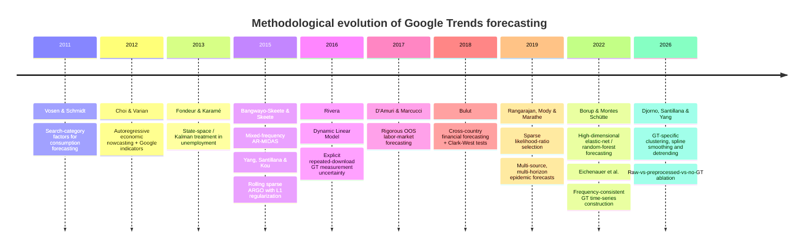
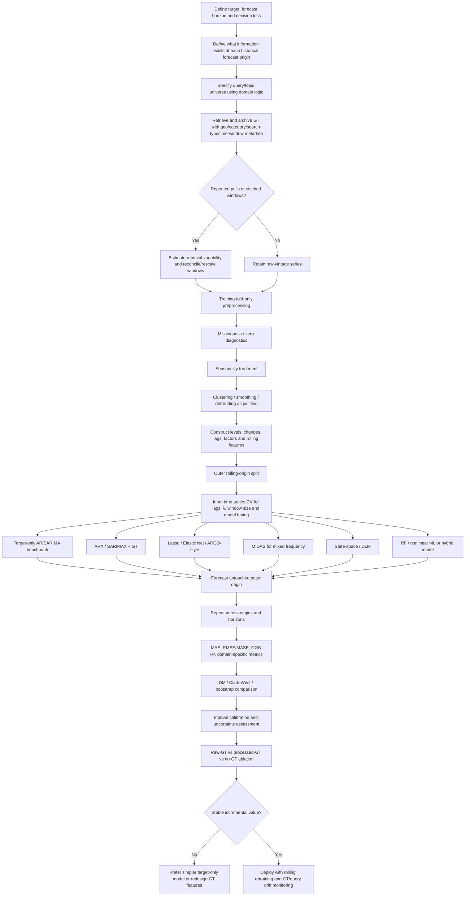

# Google Trends for Forecasting: Scientific Evidence, Mathematical Methods, and an Implementable Research Framework

## Executive Summary

Google Trends can materially improve forecasting when three conditions hold: search behavior is plausibly connected to the target-generating process, Google data are treated as noisy and drifting measurements rather than fixed covariates, and evaluation is genuinely out of sample. The strongest papers do **not** simply correlate a target with a search index. They embed Google search information in autoregressive, mixed-frequency, state-space, sparse-regression, or machine-learning frameworks and test whether the resulting forecasts beat serious target-only benchmarks. Early work established predictive value in consumption and economic nowcasting; later research introduced mixed-frequency models, rolling-window regularization, state-space treatment of Google sampling uncertainty, sparse variable selection, and high-dimensional machine learning. Most recently, research has shifted toward explicit repair of Google Trends' own data-quality problems. citeturn20view0turn20view1turn19view3turn16view0turn17view2turn18academia20

The most methodologically important general result is that **Google Trends is usually best regarded as an auxiliary signal, not a replacement for the target's own time-series history**. ARGO, for example, combines 52 autoregressive influenza lags with up to 100 search variables and dynamically refits the model in a two-year window; it substantially outperformed search-only and autoregressive alternatives. The sparse ARLR extension similarly combines autoregressive structure with Google Trends and other contemporaneous signals. This pattern is consistent with economic studies in which Google variables are added to established AR, SARIMA, structural, or fundamentals-based models rather than used alone. citeturn16view0turn17view0turn17view1turn19view3turn21view0

Three methodological families stand out:

1. **ARX/SARIMAX and sparse regularized regressions** are the strongest default when the target is a conventional weekly or monthly time series. They are interpretable, easy to benchmark, and can incorporate many lagged search variables. ARGO is the canonical example of this approach. citeturn16view0
2. **MIDAS models** are especially valuable when Google Trends arrives weekly or daily but the target is monthly or quarterly. Bangwayo-Skeete and Skeete's tourism study found that AR-MIDAS beat AR and SARIMA alternatives in most of its 12-month out-of-sample experiments. citeturn19view3
3. **State-space/Dynamic Linear Models** are particularly attractive when Google Trends itself is noisy. Rivera downloaded the same historical Trends series on 11 consecutive Thursdays and explicitly treated the different Google values as noisy measurements of a latent search process; the resulting DLM produced more realistic inference and was particularly competitive at longer forecast horizons. citeturn17view2turn16view2

High-dimensional search-term selection is another central problem. Vosen and Schmidt reduced consumption-related search categories to latent factors; ARGO used L1 penalization; Rangarajan, Mody, and Marathe developed a greedy likelihood-ratio sparse-selection algorithm; and Borup and Montes Schütte constructed a much larger panel of employment-related search variables and used modern machine-learning/regularization methods. These papers collectively indicate that arbitrary manual selection of one query is usually inferior to a controlled feature-selection process when a rich query universe is available. citeturn20view0turn16view0turn17view0turn9search17

A critical qualification is that **Google Trends is not a conventional fixed historical database**. Rivera found that repeated downloads of the same historical period can differ. Eichenauer et al. subsequently showed that raw Google Trends series at different frequencies can be inconsistent and proposed a two-step method for constructing frequency-consistent long series. The 2026 paper by Djorno, Santillana, and Yang goes further: privacy thresholds, sampling variability, noise, and algorithm changes can create zeros and unstable historical magnitudes, and the authors report that raw Google Trends variables can actually make forecasts worse. Their clustering, smoothing-spline, and detrending pipeline improved U.S. influenza-hospitalization forecasting relative to both raw Trends data and models without search information; the reported gain was about 58% nationally and 24% at state level in their validation. citeturn17view2turn13search5turn18academia20turn18search10

Accordingly, the recommended implementation is **baseline-first, vintage-aware, leakage-safe and ablation-driven**:

\[
\text{Target-only model}
\;\rightarrow\;
\text{raw-GT model}
\;\rightarrow\;
\text{preprocessed-GT model}
\;\rightarrow\;
\text{regularized/nonlinear alternatives}.
\]

All feature creation, query selection, transformations, lag selection, seasonal adjustment, dimensionality reduction, and hyperparameter tuning should be performed *inside* each training window. Forecasts should be assessed by rolling origins rather than random train/test splits; multiple horizons should be scored separately; and incremental value should be measured relative to a target-only benchmark rather than by standalone fit. This recommendation is consistent with the dynamic retraining philosophy of ARGO, the out-of-sample design of the MIDAS and exchange-rate studies, the backfill analysis of Rangarajan et al., and the raw-versus-preprocessed ablations of Djorno et al. citeturn16view0turn19view3turn17view1turn21view0turn18academia20

## Scope and Evidence Base

This is a **methodologically focused review rather than an exhaustive bibliometric review**. Priority was given to peer-reviewed papers that satisfy several of the following criteria: explicit forecasting or nowcasting rather than descriptive correlation; mathematically specified models; transparent Google Trends feature construction; genuine out-of-sample or pseudo-real-time evaluation; serious target-only benchmarks; and methodological ideas transferable beyond the paper's original domain. The sample covers consumption, labor markets, tourism, foreign exchange, influenza, dengue, and employment forecasting. citeturn20view0turn20view1turn19view3turn16view0turn17view0turn21view0

An important distinction is between **nowcasting** and **forecasting**. Some of the best-known Google Trends studies estimate a target whose official value is not yet available rather than predicting a genuinely future value. Choi and Varian explicitly frame search data as a way of forecasting near-term/current economic indicators, while ARGO estimates current influenza activity that would normally be published with a reporting delay. By contrast, studies such as Bangwayo-Skeete and Skeete, Bulut, Rangarajan et al., and Borup and Montes Schütte explicitly examine future horizons. The mathematical machinery overlaps, but evaluation should not: contemporaneous GT information may legitimately be used for a nowcast but may constitute leakage in an \(h>0\) forecast if that search observation would not yet exist at the historical forecast origin. citeturn20view1turn16view0turn19view3turn21view0turn17view1

Google Trends itself also requires unusual care. Rivera documents both the normalized nature of the search-query-volume measure and variation across repeated downloads; the same study retrieved its Google data on 11 consecutive Thursdays and modeled the repeated values as measurements of an unobserved search process. Later work on consistent Google Trends time series finds frequency inconsistencies in raw daily, weekly, and monthly series, while Djorno et al. identify missing values, sampling variation, privacy-threshold zeros, noise and historical changes associated with Google algorithm updates. These are not merely cosmetic preprocessing issues: they can alter forecast results. citeturn17view2turn13search5turn18academia20

A useful nonforecasting methodological companion is Eichenauer, Indergand, Martínez, and Sax, **[“Obtaining consistent time series from Google Trends”](https://doi.org/10.1111/ecin.13049)**, *Economic Inquiry* 60(2), 2022. Its importance for forecasting is that retrieval and rescaling should be regarded as part of the statistical measurement problem, not as a trivial download step. The paper develops a two-step procedure for constructing frequency-consistent long-run Google search-volume series. citeturn13search5turn13search0

## Comparative Review of Selected Peer-Reviewed Papers

The quality/applicability score below is an analytical score for this review, **not** a journal ranking. It allocates approximately two points each for: genuine out-of-sample/real-time evaluation; explicit preprocessing/data treatment; model transparency/reproducibility; serious benchmarks/statistical comparison; and transferability to other domains. Thus a paper may score highly even when its empirical domain is narrow if its methodology is unusually reusable.

| Paper | Authors; year; venue | Forecasting domain | Google Trends preprocessing / feature construction | Mathematical / statistical model | Evaluation metrics / protocol | Main result | Principal limitations | Quality / applicability |
|---|---|---|---|---|---|---|---|---|
| [**Forecasting private consumption: survey-based indicators vs. Google Trends**](https://doi.org/10.1002/for.1213) | Simeon Vosen, Torsten Schmidt; 2011; *Journal of Forecasting* 30(6), 565–578 | U.S. private consumption | Consumption-related Google search categories are reduced to common **factors**, producing a lower-dimensional Google consumption indicator. | Factor extraction followed by consumption forecasting regressions; comparison with University of Michigan Consumer Sentiment and Conference Board Consumer Confidence indicators. | In-sample and out-of-sample forecast-error comparisons; survey-based alternatives provide the principal benchmarks. | The Google-based indicator outperformed the two conventional sentiment indicators in almost all reported in- and out-of-sample experiments. citeturn20view0 | Early-generation Google data; factor interpretation is indirect; search-data revisions/sampling uncertainty were not yet a central part of the design. | **8.0/10** — foundational dimension-reduction approach and proper OOS comparison, but predates modern GT-vintage diagnostics. |
| [**Predicting the Present with Google Trends**](https://doi.org/10.1111/j.1475-4932.2012.00809.x) | Hyunyoung Choi, Hal Varian; 2012; *Economic Record* 88(s1), 2–9 | Automobile sales, unemployment claims, travel planning, consumer confidence | Google category/search indexes aligned to economic reporting periods; seasonal and lagged target information retained in benchmark specifications. | Relatively simple autoregressive/indicator regressions augmented with Google variables: conceptually \(y_t=\alpha+\sum\phi_i y_{t-i}+\beta x_t+\text{seasonality}+\epsilon_t\). | Near-term/nowcast forecast-error comparison against models without search data. | Demonstrated that Google search activity can add useful contemporaneous information for several economic indicators. citeturn20view1 | Primarily simple linear models; early Google data-generation regime; the emphasis is nowcasting rather than long-horizon forecasting. | **7.5/10** — extraordinarily influential and transferable conceptually, but less rigorous than later work on tuning, data vintages and uncertainty. |
| [**Can Google data help predict French youth unemployment?**](https://doi.org/10.1016/j.econmod.2012.07.017) | Yannick Fondeur, Frédéric Karamé; 2013; *Economic Modelling* 30, 117–125 | French youth unemployment | Search information is aligned with unemployment and incorporated in structural/unobserved-components models rather than treated as a standalone correlation. | **State-space / unobserved-components models**, diffuse initialization, Kalman filtering/smoothing, and multivariate specifications. citeturn22view3 | Forecast/nowcast comparisons between univariate target models and specifications containing Google information. | Shows how search data can be inserted into a latent-state framework for labor-market prediction rather than only into static regression. citeturn22view3 | One national labor-market segment; older GT extraction regime; less attention than later work to retrieval/sampling variation. | **8.0/10** — mathematically useful because it connects GT to state-space estimation and filtering. |
| [**Can Google data improve the forecasting performance of tourist arrivals? Mixed-data sampling approach**](https://doi.org/10.1016/j.tourman.2014.07.014) | Prosper F. Bangwayo-Skeete, Ryan W. Skeete; 2015; *Tourism Management* 46, 454–464 | Monthly Caribbean tourist arrivals | Composite Google indicator for searches involving **hotels and flights**, by major origin countries and destination; high-frequency search data are retained rather than simply monthly-averaged. | **AR-MIDAS**: autoregression plus parsimoniously weighted high-frequency search lags; benchmarks are AR and SARIMA. | Twelve-month out-of-sample forecasts; forecast-error comparisons, commonly including scale-dependent and percentage errors. | AR-MIDAS outperformed the alternatives in most OOS experiments, showing that mixed-frequency search information can add tourism-demand signal. citeturn19view3 | Five Caribbean destinations and a tourism-specific search index; MIDAS lag-weight specification can itself become a source of model risk. | **8.5/10** — one of the clearest demonstrations of how to exploit GT's higher sampling frequency mathematically. |
| [**Accurate estimation of influenza epidemics using Google search data via ARGO**](https://doi.org/10.1073/pnas.1515373112) | Shihao Yang, Mauricio Santillana, S. C. Kou; 2015; *PNAS* 112(47), 14473–14478 | U.S. influenza-like illness | Search counts are transformed; the model uses many individual queries rather than a single aggregate index; rolling retraining adapts to changing query behavior. | **ARGO**, a high-dimensional ARX model with L1 regularization. The implementation uses 52 target lags, up to 100 Google predictors, and a 104-week moving training window. | RMSE, MAE, MAPE, target correlation, correlation of increments; multiple benchmarks; stationary-bootstrap confidence intervals for relative efficiency; historical target-revision robustness. | ARGO beat all comparison methods over the full evaluation period and generally dominated post-2009 regular flu seasons; whole-period relative RMSE was 0.608 versus the naive benchmark's 1.0. The authors also found it at least about twice as efficient as major alternatives in their relative-efficiency analysis. citeturn16view0 | Primarily real-time estimation/nowcasting; query universe and search behavior may drift; the original implementation's regularization structure is domain-specific. | **9.5/10** — exemplary rolling evaluation, regularization, multiple benchmarks, target-vintage robustness and explicit inferential comparison. |
| [**A Dynamic Linear Model to Forecast Hotel Registrations in Puerto Rico Using Google Trends Data**](https://doi.org/10.1016/j.tourman.2016.04.008) | Rivera; 2016; *Tourism Management* 57, 12–20 | Puerto Rico nonresident hotel registrations | Nine travel queries are combined to reduce missingness/collinearity. Crucially, the identical historical series is downloaded on **11 consecutive Thursdays**, allowing Google retrieval variation to be modeled. Monthly conversion, seasonal diagnostics, SARIMA diagnostics and lag/cross-correlation analysis are performed. | **Dynamic Linear Model / state-space model** with hotel registrations and repeated GT downloads as observations of latent processes, plus seasonal states; compared with simpler time-series alternatives. | Multi-horizon forecast errors plus predictive intervals; horizon-specific model comparisons. | The DLM gives more realistic treatment of search uncertainty; simpler models can win at short horizons, while the DLM using Google information performs better particularly beyond roughly six months. citeturn17view2turn16view2 | One destination; weak-to-moderate search/target association; query selection partly heuristic; GT is relative rather than absolute and its algorithm is opaque. | **9.0/10** — unusually important because GT retrieval noise becomes part of the probabilistic model rather than an ignored nuisance. |
| [**The predictive power of Google searches in forecasting US unemployment**](https://doi.org/10.1016/j.ijforecast.2017.03.004) | Francesco D'Amuri, Juri Marcucci; 2017; *International Journal of Forecasting* 33(4), 801–816 | U.S. unemployment | A Google job-search indicator centered on searches associated with “jobs” is aligned and seasonally treated before inclusion with unemployment history. | Autoregressive/time-series forecasting models augmented with the Google job-search index; extensive out-of-sample comparison. | Multi-horizon OOS forecast-error evaluation against conventional unemployment forecasting specifications. | Establishes the Google job-search index as a serious leading-information competitor for U.S. unemployment forecasting, including turning-point behavior. citeturn1search20turn15search3 | Heavy dependence on one labor-market concept/query family and one country; subsequent GT-generation changes may reduce literal reproducibility with today's downloads. | **8.5/10** — strong forecasting orientation and OOS design; less GT-measurement robustness than later papers. |
| [**Google Trends and the forecasting performance of exchange rate models**](https://doi.org/10.1002/for.2500) | Levent Bulut; 2018; *Journal of Forecasting* 37(3), 303–315 | Monthly exchange-rate returns for 11 OECD currencies | Search-query variables are incorporated into competing exchange-rate specifications over Jan. 2004–Jun. 2014. | GT predictive regressions compared with purchasing-power-parity and monetary-fundamentals models and the random-walk benchmark. | Out-of-sample forecast errors, direction-of-change performance, Theil-type comparisons, and **Clark–West equal-predictive-accuracy inference**. | Search variables were particularly useful for predicting direction. Monetary fundamentals beat the random-walk null for only 1/11 currency pairs, whereas the GT specifications showed evidence of improvement for 5 pairs; directional performance strengthened after the Great Recession. citeturn21view0 | Improvements are heterogeneous across currencies; predicting sign and predicting magnitude are different goals; financial relationships are especially unstable. | **8.5/10** — good cross-sectional breadth, strong benchmark and forecast-inference discipline. |
| [**Forecasting dengue and influenza incidences using a sparse representation of Google Trends, electronic health records, and time series data**](https://doi.org/10.1371/journal.pcbi.1007518) | Prashant Rangarajan, Sandeep K. Mody, Madhav Marathe; 2019; *PLOS Computational Biology* 15(11), e1007518 | Dengue in five countries/regions; U.S. influenza | Systematic deseasoning; many GT predictors combined with target lags; ILI models additionally use EHR data. | **Autoregressive Likelihood Ratio (ARLR)** sparse model: greedy likelihood-ratio variable inclusion with information-criterion stopping; compared with ARGO/lasso, Kalman and ensemble models. | RMSE, MAE, MAPE; real-time and 1–4-week horizons; peak magnitude and peak timing. | Averaged across dengue settings, ARLR reduced real-time forecast error by about 18% across reported error measures relative to ARGO; for ILI it reduced one-week-ahead RMSE by 17% and average 2–4-week-ahead RMSE by about 19%. citeturn17view0turn17view1 | ILI performance partly reflects EHR information as well as GT; national models are easier than regional forecasting; Internet penetration affects signal quality. | **9.0/10** — excellent sparse-selection comparison, multi-disease/multi-geography evaluation and multi-horizon scoring. |
| [**In Search of a Job: Forecasting Employment Growth Using Google Trends**](https://doi.org/10.1080/07350015.2020.1791133) | Daniel Borup, Erik Christian Montes Schütte; 2022; *Journal of Business & Economic Statistics* 40(1), 186–200 | U.S. employment growth, including industries/states | Starting from employment concepts such as “jobs,” related Google searches are used to construct a high-dimensional panel of roughly 172 search variables; predictor targeting/selection is important. | High-dimensional regularized and machine-learning forecasting, including **elastic net** and **random forests**, compared with conventional macroeconomic/financial/sentiment predictor sets. | Out-of-sample \(R^2\) across horizons from one month to about one year. | Relevant Google search activity produces substantial positive OOS predictive power and can beat models based on conventional macro/financial/sentiment information; heterogeneity across queries is central to the gain. citeturn9search17turn13search2 | High-dimensional model tuning increases leakage risk if not nested correctly; older historical GT values may not correspond to true archived data vintages. | **9.0/10** — strong example of the transition from hand-picked keywords to large-panel ML forecasting. |
| [**Restoring the forecasting power of Google Trends with statistical preprocessing**](https://doi.org/10.1016/j.ijforecast.2026.03.001) | Candice Djorno, Mauricio Santillana, Shihao Yang; 2026; *International Journal of Forecasting* 42(3), 1104–1122 | U.S. influenza hospitalizations, national and state | Explicit pipeline for GT-specific corruption: **hierarchical clustering → smoothing splines → detrending**; addresses zeros, sampling noise, missingness and structural magnitude changes. | Preprocessed exogenous signals enter **ARIMAX** forecasting models; raw-GT and no-GT models form essential ablations. | Forecast-error comparison for influenza hospitalization forecasts, including horizons up to several weeks; national/state evaluation. | Raw GT can degrade forecasting, while statistically repaired signals improve it. The authors report roughly **58% national and 24% state-level accuracy improvement** relative to omitting exogenous signals in their validation. citeturn18academia20turn18search10 | Evidence is still concentrated in one public-health application; the optimal preprocessing intensity may differ when abrupt search spikes are themselves meaningful. | **9.5/10** — currently one of the most directly actionable studies because it treats GT data quality itself as a first-class forecasting problem. |

The papers collectively show an evolution from “does search volume correlate with the outcome?” to “what is the correct statistical measurement, selection, dynamic updating, and validation system for search-derived predictors?” Vosen and Schmidt already recognized dimensionality reduction; ARGO formalized dynamic high-dimensional selection; Rivera explicitly modeled search-data measurement uncertainty; Rangarajan et al. developed alternative sparse selection; Borup and Montes Schütte moved toward large-panel ML; and Djorno et al. place substantial statistical machinery *before* the forecasting model itself. citeturn20view0turn16view0turn17view2turn17view0turn9search17turn18academia20

## Implementable Methods and Mathematics

The following framework is deliberately domain-neutral. Let \(y_t\) denote the forecasting target and let

\[
\mathbf{x}_t=(x_{1t},\ldots,x_{Kt})'
\]

denote Google Trends features that are genuinely available at forecast origin \(t\). For an \(h\)-step forecast, the required information set is

\[
\mathcal I_t=
\{y_t,y_{t-1},\ldots;\mathbf{x}_t,\mathbf{x}_{t-1},\ldots;\mathbf z_t,\ldots\},
\]

where \(\mathbf z_t\) contains non-Google covariates. The operational requirement is:

\[
\hat y_{t+h|t}=f_h(\mathcal I_t),
\]

with **nothing constructed using observations after \(t\)**.

### Google Trends acquisition and measurement treatment

Google Trends values should not be treated as absolute counts. Rivera's study makes explicit that query-volume results depend on settings such as location, category, search type and time period, and that identical historical windows can vary across downloads. Its solution was to make repeated GT values noisy observations of an unobserved underlying search process. Djorno et al. document additional instability associated with zeros, sampling noise and algorithm changes. citeturn17view2turn18academia20

For query \(k\), retain metadata alongside every series:

\[
(\text{query/topic},\text{geography},\text{category},
\text{search type},\text{time range},
\text{retrieval timestamp}).
\]

This is essential for reproducibility. If feasible, archive repeated snapshots:

\[
x_{k,t}^{(r)}, \qquad r=1,\dots,R,
\]

where \(r\) indexes independent retrievals. Then define, for example,

\[
\bar x_{k,t}
=
\frac1R\sum_{r=1}^R x_{k,t}^{(r)}
\]

and an empirical retrieval variance

\[
\hat\sigma^2_{GT,k,t}
=
\frac{1}{R-1}
\sum_{r=1}^{R}
\left(x_{k,t}^{(r)}-\bar x_{k,t}\right)^2.
\]

The mean can be used as a noise-reduced signal; the variance can enter a state-space measurement equation. Rivera's repeated-download design is direct empirical motivation for this treatment. citeturn17view2

When long historical series must be assembled from different Google windows/frequencies, a stitching/rescaling procedure should be used rather than naively concatenating independently normalized windows. Eichenauer et al.'s frequency-consistency work is particularly relevant here. citeturn13search5

### Feature engineering from Google Trends

Useful candidate features can be organized into five classes.

**Level and monotone transformations**

\[
x_t,\qquad
\log(x_t+\delta),\qquad
\sqrt{x_t}.
\]

A small \(\delta>0\) prevents a logarithm of zero. ARGO used log-transformed Google information and regularized the resulting high-dimensional predictors. citeturn16view0

**Changes and acceleration**

\[
\Delta x_t=x_t-x_{t-1},
\]

\[
g_t=\log(x_t+\delta)-\log(x_{t-1}+\delta),
\]

\[
\Delta^2x_t=\Delta x_t-\Delta x_{t-1}.
\]

Changes are valuable when the target responds to *changes in attention* rather than search levels. For asset returns in particular, level regressions can be economically inappropriate even if directional information remains useful, as Bulut's exchange-rate results illustrate. citeturn21view0

**Lagged search features**

\[
x_t,x_{t-1},\ldots,x_{t-L}.
\]

For a genuinely forward \(h\)-step forecast, the contemporaneous \(x_t\) is legitimate only if it existed at origin \(t\). For nowcasts, contemporaneous search information is often precisely the benefit of Google Trends. Choi–Varian and ARGO exploit this reporting-timeliness advantage. citeturn20view1turn16view0

**Smoothed and local-trend features**

For a rolling average,

\[
MA_{q,t}=\frac1q\sum_{j=0}^{q-1}x_{t-j}.
\]

An exponentially weighted version is

\[
EWMA_t
=
\alpha x_t+(1-\alpha)EWMA_{t-1},
\qquad 0<\alpha<1.
\]

A local slope can be estimated by fitting

\[
x_{t-j}=a+bj+\epsilon_j,
\qquad j=0,\ldots,q-1,
\]

and using \(\hat b\) as a momentum feature.

Djorno et al.'s newer preprocessing framework is more statistically structured: redundant signals are clustered, noisy series are smoothed by splines, and trends are removed before forecasting. Their finding that raw data can perform worse than no search variables is a strong argument for treating these transformations as model components that require validation rather than automatic improvements. citeturn18academia20

**Cross-query dimension reduction**

For a \(T\times K\) standardized query matrix \(X\), factor/PCA reduction writes

\[
X = F\Lambda' + E,
\]

where \(F\) contains \(r\ll K\) latent search factors. Forecast with

\[
y_{t+h}
=
\alpha
+
\sum_{j=1}^{p}\phi_j y_{t+1-j}
+
\boldsymbol{\gamma}'\mathbf f_t
+
\epsilon_{t+h}.
\]

This is conceptually the approach behind Vosen and Schmidt's extraction of factors from consumption-related search categories. citeturn20view0

**Assumptions.** Search terms in a factor should share common information, and the factor structure should remain reasonably stable.

**Strengths.** Reduces multicollinearity and estimation variance; suitable for dozens or hundreds of related queries.

**Weaknesses.** PCA optimizes variance in \(X\), not predictive relevance for \(y\). A high-variance search factor need not be the factor most useful for forecasting.

**Cross-domain adaptation.** Build semantically coherent families first: e.g., “symptom” searches in health, “purchase intent” searches in retail, “job loss/job search” in labor, or destination/flight/hotel terms in tourism; then perform the factor extraction *inside the training fold*.

### Classical ARX and SARIMAX models

A strong first Google-augmented benchmark is

\[
y_t
=
c
+
\sum_{i=1}^{p}\phi_i y_{t-i}
+
\sum_{k=1}^{K}\sum_{\ell=0}^{L_k}
\beta_{k\ell}x_{k,t-\ell}
+
\boldsymbol{\gamma}'\mathbf d_t
+
\epsilon_t,
\]

where \(\mathbf d_t\) contains seasonal dummies, Fourier terms, holidays or other calendar controls.

For seasonal ARIMA errors,

\[
\Phi(B)\Phi_s(B^s)
(1-B)^d(1-B^s)^D y_t
=
c+\boldsymbol{\beta}'X_t
+
\Theta(B)\Theta_s(B^s)\epsilon_t.
\]

This encompasses ARIMAX/SARIMAX. Search information is evaluated incrementally through \(\boldsymbol\beta\). Choi and Varian's augmented autoregressive logic, the AR components of ARGO, and Djorno et al.'s ARIMAX validation all belong to this general family. citeturn20view1turn16view0turn18academia20

**Assumptions.** After transformations and differencing, remaining dynamics are sufficiently stable and approximately linear; residual dependence is properly modeled; search covariates available at the forecast origin are correctly recorded.

**Data requirement.** Often usable with a few years of weekly/monthly data, provided parameter count stays small relative to \(T\).

**Strengths.** Transparent coefficients, strong benchmark, easy lag interpretation, straightforward intervals under conventional assumptions.

**Weaknesses.** Sensitive to multicollinearity and high \(K\times L\); weak against nonlinearities/regime changes; coefficient instability can be severe when user search behavior changes.

**Adaptation.** This should usually be the first implementation in a new domain before more complicated ML is attempted.

### Sparse ARX, lasso and elastic net

Once many search queries and lags are available, ordinary least squares becomes unstable. Let

\[
\mathbf w=
(\boldsymbol\phi',\boldsymbol\beta')'
\]

collect autoregressive and Google coefficients.

The lasso estimate is

\[
\hat{\mathbf w}
=
\arg\min_{\mathbf w}
\left\{
\frac{1}{T}\sum_t
\left(
y_t-\mathbf z_t'\mathbf w
\right)^2
+
\lambda \|\mathbf w\|_1
\right\}.
\]

Elastic net generalizes this to

\[
\hat{\mathbf w}
=
\arg\min_{\mathbf w}
\left[
\frac{1}{T}\sum_t
(y_t-\mathbf z_t'\mathbf w)^2
+
\lambda
\left(
\rho\|\mathbf w\|_1
+
\frac{1-\rho}{2}\|\mathbf w\|_2^2
\right)
\right].
\]

Here \(0\leq\rho\leq1\). Lasso corresponds to \(\rho=1\); ridge approaches \(\rho=0\).

ARGO is the best-known Google Trends application. In simplified form,

\[
y_t
=
\mu
+
\sum_{j=1}^{N}\alpha_jy_{t-j}
+
\sum_{k=1}^{K}\beta_kX_{k,t}
+
\epsilon_t,
\]

with yearly seasonal history represented by \(N=52\) weekly lags, as many as \(K=100\) search terms, and dynamic refitting on the preceding 104 weeks. The paper applies L1 regularization to select useful information automatically. citeturn16view0turn7view2

**Assumptions.** A relatively small subset, or a shrinkable combination, of the candidate features contains useful predictive information; the recent training window represents the near-future relationship.

**Strengths.** Scales to \(K>T\), automatically controls many irrelevant queries and lags, and is computationally inexpensive.

**Weaknesses.** Highly correlated queries can make lasso selections unstable. Coefficients are biased toward zero. Cross-validation itself can be unstable with short time series.

**Adaptation.** Prefer elastic net when many search terms are near substitutes. Standardize all predictors *using training-window statistics only*:

\[
x^{*}_{k,t}
=
\frac{x_{k,t}-\mu_{k,\text{train}}}
{\sigma_{k,\text{train}}}.
\]

Never compute \(\mu\), \(\sigma\), feature selection, or PCA over the full sample before splitting.

### Sparse likelihood-ratio selection

Rangarajan et al.'s ARLR provides an alternative when one expects a very sparse model but does not want shrinkage bias. The broad algorithm is: start with a minimal autoregressive model; evaluate each unused candidate by its improvement in likelihood; add the candidate producing the greatest statistically/information-criterion-justified gain; repeat until an AICc-type criterion stops improving. The paper reports better sparse recovery than lasso in its simulations and lower forecast errors in most empirical comparisons. citeturn17view0turn17view1

A generic implementation is:

```text
S ← mandatory autoregressive terms
best_score ← AICc(model using S)

repeat
    for each candidate feature j not in S:
        fit model with S ∪ {j}
        compute likelihood-ratio improvement
        compute AICc

    j* ← candidate with strongest admissible improvement

    if AICc(S ∪ {j*}) < best_score:
        S ← S ∪ {j*}
        best_score ← AICc(S)
    else:
        stop

refit model using S
forecast
```

**Strengths.** Produces a genuinely sparse, interpretable equation and can work well when sample sizes are modest.

**Weaknesses.** Greedy search can miss combinations of jointly useful variables; repeated selection magnifies data-mining risk unless every step occurs inside the training window.

**Best use.** Moderate-\(T\), large-\(K\) forecasting where interpretability and parsimonious predictor selection matter.

### MIDAS for mixed-frequency search data

Aggregating weekly Google Trends to monthly averages discards timing information. MIDAS instead predicts a low-frequency target directly from high-frequency lags:

\[
y_t
=
\alpha
+
\sum_{r=1}^{p}\phi_r y_{t-r}
+
\beta
\sum_{j=0}^{J}
w(j;\theta)x^{(H)}_{t,j}
+
\epsilon_t,
\]

where \(x^{(H)}\) is a weekly/daily search series and \(w(j;\theta)\) is a low-dimensional lag-weight function.

A common exponential-Almon form is

\[
w_j(\theta)
=
\frac{
\exp(\theta_1j+\theta_2j^2)
}{
\sum_{q=0}^{J}
\exp(\theta_1q+\theta_2q^2)
}.
\]

Instead of estimating \(J+1\) unrelated coefficients, one estimates \(\theta_1,\theta_2\) and an overall effect \(\beta\). Bangwayo-Skeete and Skeete used AR-MIDAS to retain the higher-frequency tourism-search information and found it beat monthly AR/SARIMA competitors in most OOS experiments. citeturn19view3

**Assumptions.** The high-frequency lag-response shape can be represented parsimoniously.

**Data requirement.** Low-frequency target plus correctly timestamped high-frequency Google data.

**Strengths.** Natural for weekly GT versus monthly sales, monthly tourism, quarterly GDP, etc.; avoids arbitrary temporal aggregation.

**Weaknesses.** Wrong lag-weight shape can hide a real effect. Optimization is nonlinear. Search observations within the current month must be handled according to what was actually available at each forecast date.

**Adaptation.** Particularly attractive for quarterly economic variables, where weekly GT offers many within-quarter observations.

### State-space models and Google measurement error

A generic dynamic linear model is

\[
\mathbf y_t
=
H_t\mathbf s_t+\mathbf v_t,
\qquad
\mathbf v_t\sim N(0,R_t),
\]

\[
\mathbf s_t
=
F_t\mathbf s_{t-1}+\mathbf w_t,
\qquad
\mathbf w_t\sim N(0,Q_t).
\]

The latent state \(\mathbf s_t\) can contain the target level, slope, seasonal components, time-varying Google coefficient and latent “true” search intensity.

Rivera's model is especially instructive. In its general form,

\[
\mathbf Y_t
=
F\mathbf X_t+H\mathbf S_t+\boldsymbol\nu_t,
\]

\[
\mathbf X_t
=
G^{(x)}\mathbf X_{t-1}
+
C\mathbf S_t
+
\boldsymbol\omega_t^{(x)},
\]

\[
\mathbf S_t
=
G^{(s)}\mathbf S_{t-1}
+
\boldsymbol\omega_t^{(s)},
\]

with Gaussian measurement/evolution disturbances. Repeated Google Trends downloads are multiple noisy observations of the latent search process. citeturn17view2

Kalman prediction:

\[
\hat s_{t|t-1}
=
F_t\hat s_{t-1|t-1},
\]

\[
P_{t|t-1}
=
F_tP_{t-1|t-1}F_t'
+
Q_t.
\]

Update with observation \(y_t\):

\[
K_t
=
P_{t|t-1}H_t'
\left(
H_tP_{t|t-1}H_t'+R_t
\right)^{-1},
\]

\[
\hat s_{t|t}
=
\hat s_{t|t-1}
+
K_t
(y_t-H_t\hat s_{t|t-1}).
\]

This immediately produces probabilistic forecasts through the state covariance.

**Assumptions.** Classical implementation assumes linear evolution and approximately Gaussian innovations, although extensions relax both.

**Strengths.** Handles missing observations, evolving coefficients, latent trends, seasonality, irregular measurement, and explicit GT retrieval noise.

**Weaknesses.** More model-design choices; covariance matrices can be weakly estimated in short samples; Gaussian prediction intervals understate uncertainty if parameters themselves are uncertain.

**Adaptation.** Strong choice when repeated GT pulls show nontrivial dispersion or when the GT/target relationship visibly changes over time.

### Random forests and nonlinear machine learning

Construct at origin \(t\)

\[
\mathbf z_t=
[
y_t,\ldots,y_{t-p},
x_{1,t},\ldots,x_{K,t-L},
\text{calendar variables},
\mathbf q_t
],
\]

and estimate

\[
\hat y_{t+h}=g_h(\mathbf z_t).
\]

For a random forest,

\[
\hat y_{t+h}
=
\frac1B
\sum_{b=1}^{B}T_b(\mathbf z_t),
\]

where each tree \(T_b\) is trained on a bootstrap/subsample with randomized predictor selection. Borup and Montes Schütte's employment application illustrates the usefulness of random forests and regularized models when the Google feature space contains many heterogeneous employment-related queries rather than a single index. citeturn9search17

**Assumptions.** No linearity assumption, but training/test relationships must be sufficiently stable that learned splits generalize.

**Strengths.** Nonlinearities, thresholds and interactions can be discovered automatically; no need to prespecify a linear response to search activity.

**Weaknesses.** Tree models extrapolate poorly outside the historical target range, prediction explanations are less structural, and they can overfit spectacular search spikes with short samples.

**Adaptation.** Most appropriate with large panels or many geographic units. With only 100 monthly observations, a heavily tuned boosted-tree/deep-learning architecture should generally face a very high evidentiary bar against simple ARX.

### Hybrid and ensemble models

A useful hybrid separates predictable target dynamics from incremental search information:

\[
y_t
=
\hat y_t^{TS}
+
r_t,
\]

then models

\[
r_t=g(\mathbf x_t,\mathbf x_{t-1},\ldots).
\]

Hence

\[
\hat y_{t+h}
=
\hat y_{t+h}^{TS}
+
\hat r_{t+h}^{GT}.
\]

This has an attractive interpretation: the Google learner is asked only to explain what the classical model misses.

A forecast ensemble is

\[
\hat y_{t+h}^{ens}
=
\sum_{m=1}^{M}
w_m\hat y_{t+h}^{(m)},
\qquad
w_m\ge0,\quad\sum_mw_m=1.
\]

Weights may be equal, inverse-error weighted, or estimated in an inner rolling-validation loop. The empirical literature's repeated finding that Google signals are sometimes useful and sometimes harmful makes combinations attractive: Rivera finds horizon-specific differences among models, Bulut obtains heterogeneous results across currencies, and Djorno et al. show that raw search data can worsen forecasts. citeturn16view2turn21view0turn18academia20

### Seasonality

Search behavior is often highly seasonal for reasons unrelated to the target. A robust design distinguishes target seasonality from search seasonality.

For deterministic seasonality, include dummies or Fourier terms:

\[
S_t
=
\sum_{k=1}^{K_s}
\left[
a_k\sin\left(\frac{2\pi kt}{s}\right)
+
b_k\cos\left(\frac{2\pi kt}{s}\right)
\right].
\]

For stochastic seasonality:

\[
\nabla_s y_t
=
y_t-y_{t-s},
\]

followed by SARIMA/SARIMAX modeling.

For a search-specific seasonal anomaly,

\[
x^{anom}_t
=
x_t-
\hat E[x_t\mid\text{seasonal position}],
\]

where the expectation is estimated on the **training data only**.

ARGO represents yearly influenza dynamics partly through 52 weekly target lags; Rangarajan et al. instead emphasize systematic deseasoning; Rivera explicitly models a 12-month seasonal component in the tourism DLM. These alternatives demonstrate that there is no requirement to seasonally adjust all GT series in the same manner. citeturn16view0turn17view1turn17view2

A useful rule is to compare:

\[
\text{raw GT}
\quad\text{vs}\quad
\text{seasonally adjusted GT}
\quad\text{vs}\quad
\text{target-and-GT jointly seasonal model}.
\]

Treat the choice as an empirical forecasting decision rather than a mandatory preprocessing convention.

### Lag selection

A large unconstrained lag search creates enormous scope for accidental predictability. For \(K\) queries and \(L+1\) lags, the GT block alone contains

\[
K(L+1)
\]

candidate coefficients.

A disciplined procedure is:

```text
1. Specify the maximum plausible lead/lag from the real-world process.
2. On training data only:
      a. remove major target/search seasonality;
      b. optionally prewhiten both series;
      c. inspect cross-correlation as a screening diagnostic.
3. Construct the candidate lag block.
4. Choose among lags using:
      - AIC/AICc/BIC for a low-dimensional model, or
      - lasso/elastic net for a high-dimensional block, or
      - inner rolling-origin CV.
5. Re-estimate on the full outer-training window.
6. Forecast the untouched outer test origin.
```

Rivera used prewhitening and cross-correlation to identify a roughly one-month search/registration relationship before model fitting, illustrating a classical version of this workflow. citeturn16view2

A critical restriction is that **cross-correlation should never be computed over the complete training-plus-test sample and then used to decide lags**. That allows future target information to influence predictor construction.

### Regularization and tuning

For every value of \(\lambda\) or \((\lambda,\rho)\), score performance on temporally ordered validation origins. Do **not** optimize hyperparameters using random \(K\)-fold partitions, because adjacent past and future observations leak temporal structure.

A nested procedure is:

```text
for outer forecast origin o:
    train_outer = observations ≤ o
    test_outer  = target at o+h

    for hyperparameter θ in candidate_grid:
        losses = []

        for inner origin i within train_outer:
            fit preprocessing on data ≤ i
            fit model with θ on data ≤ i
            predict i+h
            append loss

        CV(θ) = mean(losses)

    θ* = argminθ CV(θ)

    refit preprocessing + model using train_outer and θ*
    forecast test_outer
```

ARGO's use of a rolling two-year fitting window embodies the broader principle that coefficients/search relevance should be dynamically refreshed rather than estimated once over an entire history. citeturn16view0

Use a **sliding window** if behavioral drift is strong:

\[
\mathcal T_t
=
\{t-W+1,\ldots,t\},
\]

and an **expanding window** if older information remains valuable:

\[
\mathcal T_t
=
\{1,\ldots,t\}.
\]

The window length \(W\) is itself a tunable parameter. Rangarajan et al., for example, report materially worse disease-forecast RMSE with shorter two- or three-year windows than with their four-year window, illustrating that the bias–adaptation trade-off is application-dependent. citeturn17view1

### Uncertainty quantification

Point accuracy alone is insufficient when GT measurements themselves are noisy.

For a Gaussian linear/state-space forecast,

\[
y_{t+h}\mid\mathcal I_t
\sim
N(\hat y_{t+h|t},P_{y,t+h|t}),
\]

so a nominal \(100(1-\alpha)\%\) interval is

\[
\hat y_{t+h|t}
\pm
z_{1-\alpha/2}
\sqrt{P_{y,t+h|t}}.
\]

This is a natural consequence of Rivera's DLM setup. citeturn17view2

For models without analytic intervals, use a time-series residual bootstrap rather than IID resampling:

```text
Fit model on training data
Compute time-ordered residuals

for b = 1,...,B:
    sample residual BLOCKS, preserving local dependence
    generate a bootstrap future path
    optionally resample/retrieve GT measurement noise
    refit if parameter uncertainty is to be included
    save forecast

lower = empirical α/2 quantile of forecasts
upper = empirical 1-α/2 quantile
```

ARGO used a stationary bootstrap of the forecast-error series to construct confidence intervals for relative predictive efficiency, demonstrating why time dependence in forecast errors should not simply be discarded. citeturn16view0

A simple rolling conformal extension can also be implemented without imposing Gaussian errors. Given recent absolute residuals

\[
a_j=|y_j-\hat y_j|,
\]

take their empirical \((1-\alpha)\) quantile \(q_{1-\alpha}\) and form

\[
[
\hat y_{t+h}-q_{1-\alpha},
\hat y_{t+h}+q_{1-\alpha}
].
\]

Under rapid drift, use only recent calibration residuals or exponential weights rather than the entire history.

## Evaluation Protocols and Metrics

A credible Google Trends forecasting experiment must answer a causal-looking but purely predictive question:

\[
\text{"How much information does GT add beyond what was already forecastable without GT?"}
\]

That makes the **benchmark architecture** as important as the Google model. ARGO compares against autoregression, naive forecasts, Google Flu Trends and other search models; Bangwayo-Skeete and Skeete compare AR-MIDAS with AR and SARIMA; Bulut uses random-walk and structural exchange-rate competitors; and Djorno et al. explicitly contrast raw GT, statistically preprocessed GT, and no-GT models. citeturn16view0turn19view3turn21view0turn18academia20

At minimum, evaluate four specifications:

\[
M_0:\text{naive/seasonal-naive},
\]

\[
M_1:\text{target-only AR/SARIMA/ETS or domain benchmark},
\]

\[
M_2:\text{target + raw GT},
\]

\[
M_3:\text{target + preprocessed/selected GT}.
\]

For high-dimensional work, add

\[
M_4:\text{regularized or ML target+GT model}.
\]

This ablation distinguishes “Google Trends contains signal” from “a sufficiently flexible model happens to fit better.”

**Rolling-origin protocol.** Suppose the initial training window ends at \(T_0\). For each origin

\[
t=T_0,T_0+1,\ldots,T-h,
\]

fit using only information available through \(t\), then generate

\[
\hat y_{t+h|t}.
\]

Repeat separately for \(h=0,1,2,\ldots,H\). ARGO's retrospective procedure explicitly restricted historical target data to information that would have been available at the time and also tested the impact of later target revisions; Rangarajan et al. similarly show that backfilled disease data can make apparent forecast skill substantially better than true real-time data. citeturn16view0turn17view1

For release-revised targets, therefore, distinguish:

\[
\text{pseudo-OOS using final revised target history}
\]

from

\[
\text{real-time OOS using vintage data}.
\]

The same principle applies to Google Trends. A historical value downloaded today is not automatically equivalent to the value a forecaster would have downloaded years ago, as repeated-download evidence and later GT-consistency studies show. citeturn17view2turn13search5turn18academia20

**MAE**

\[
MAE
=
\frac1n
\sum_{t=1}^{n}
|y_t-\hat y_t|.
\]

Use when errors have direct units and robustness to a few large misses is desirable.

**RMSE**

\[
RMSE
=
\sqrt{
\frac1n
\sum_{t=1}^{n}
(y_t-\hat y_t)^2
}.
\]

RMSE penalizes large misses more strongly. ARGO and Rangarajan et al. both report RMSE together with MAE and MAPE, which is preferable to claiming superiority from a single loss function. citeturn16view0turn17view1

**MASE**

For seasonal period \(s\),

\[
MASE
=
\frac{
\frac1n\sum|y_t-\hat y_t|
}{
\frac{1}{T-s}
\sum_{t=s+1}^{T}
|y_t-y_{t-s}|
}.
\]

Values below one imply lower average absolute error than the in-sample seasonal-naive scaling denominator. MASE is particularly useful for comparisons across states, countries, products or currencies whose target levels differ greatly.

**MAPE**

\[
MAPE
=
\frac{100}{n}
\sum_t
\left|
\frac{y_t-\hat y_t}{y_t}
\right|.
\]

ARGO and Rangarajan et al. report MAPE, but it should not be the only metric when \(y_t\) may approach zero because the denominator makes errors unstable. citeturn16view0turn17view1

**sMAPE**

\[
sMAPE
=
\frac{200}{n}
\sum_t
\frac{
|y_t-\hat y_t|
}{
|y_t|+|\hat y_t|
}.
\]

This avoids some, though not all, problems of ordinary percentage errors.

**Out-of-sample \(R^2\)**

Relative to benchmark forecast \(\hat y_{0,t}\),

\[
R^2_{OS}
=
1-
\frac{
\sum_t(y_t-\hat y_{1,t})^2
}{
\sum_t(y_t-\hat y_{0,t})^2
}.
\]

Thus

\[
R^2_{OS}>0
\]

means the GT model lowers cumulative squared error relative to the benchmark. This is especially useful for studies like Borup and Montes Schütte where the central question is incremental predictive content. citeturn9search17

**Directional accuracy**

For prices, growth rates or turning points,

\[
DA
=
\frac1n
\sum_t
I
\left[
\operatorname{sign}
(\hat y_t-y_{t-1})
=
\operatorname{sign}
(y_t-y_{t-1})
\right].
\]

Bulut's results show why this deserves separate reporting: Google predictors can add substantial information about exchange-rate direction even when magnitude forecasting remains difficult. citeturn21view0

**Correlation.** Correlation should be secondary, not a principal forecast metric. A forecast can correlate almost perfectly with a highly persistent series while being systematically biased. ARGO appropriately reports correlation together with error measures rather than substituting it for them. citeturn16view0

**Event-specific metrics.** When the decision problem concerns peaks, additionally report

\[
|\hat y_{\text{peak}}-y_{\text{peak}}|
\]

and

\[
|\hat t_{\text{peak}}-t_{\text{peak}}|.
\]

Rangarajan et al. explicitly evaluate epidemic peak value and peak timing, illustrating why generic RMSE may miss the operational objective. citeturn17view0turn17view1

**Interval coverage**

For nominal \(1-\alpha\) intervals \([L_t,U_t]\),

\[
Coverage
=
\frac1n
\sum_t I(L_t\le y_t\le U_t).
\]

Coverage should be reported jointly with average interval width,

\[
Width=\frac1n\sum_t(U_t-L_t),
\]

because trivially wide intervals can attain excellent coverage.

A useful proper interval score is

\[
IS_\alpha
=
(U-L)
+
\frac{2}{\alpha}(L-y)I(y<L)
+
\frac{2}{\alpha}(y-U)I(y>U).
\]

Lower values reward narrow calibrated intervals while penalizing observations outside the interval.

**Forecast-comparison tests.** For two nonnested models define

\[
d_t=L(e_{0,t})-L(e_{1,t}).
\]

A Diebold–Mariano-style statistic is

\[
DM
=
\frac{\bar d}
{\sqrt{\widehat{\operatorname{Var}}(\bar d)}}.
\]

For \(h>1\), forecast errors overlap, so the variance estimator should allow serial dependence.

When a GT model nests the benchmark, a Clark–West adjustment is more appropriate. With benchmark 0 and larger GT model 1,

\[
d_t^{CW}
=
e_{0,t}^{2}
-
\left[
e_{1,t}^{2}
-
(\hat y_{0,t}-\hat y_{1,t})^2
\right].
\]

A significantly positive mean favors the augmented model after compensating for the larger model's extra estimation noise. Bulut explicitly applies Clark–West equal-predictive-accuracy inference rather than relying only on raw error rankings. citeturn21view0

The recommended reporting unit is therefore a horizon-by-model matrix:

| Required result | Why it matters |
|---|---|
| MAE + RMSE or MASE | Establish absolute point-forecast performance under complementary loss functions. |
| \(R^2_{OS}\) / relative error | Quantifies incremental value relative to the exact non-GT benchmark. |
| Raw-GT vs processed-GT ablation | Detects whether preprocessing, rather than search data per se, drives improvement; especially important after Djorno et al. citeturn18academia20 |
| Performance by horizon \(h\) | Google information may help nowcasts but decay rapidly, or, as in Rivera's application, become comparatively more useful at longer horizons. citeturn16view2 |
| Performance by regime | Search behavior can change around crises, pandemics, media events or platform changes; Bulut finds different directional behavior after the Great Recession. citeturn21view0 |
| Statistical test / bootstrap CI | Distinguishes persistent predictive improvement from sampling variability; ARGO uses stationary-bootstrap inference. citeturn16view0 |
| Prediction-interval coverage and width | Evaluates uncertainty, not merely the mean prediction. |
| Query/feature-selection stability | Reveals whether “predictive terms” persist or change arbitrarily between origins. |
| Real-time/vintage sensitivity | Essential when targets are revised or GT historical values are unstable. citeturn16view0turn17view2 |

## Methodological Evolution and Recommended Pipeline

The broad evolution is from simple Google-augmented regressions toward models that simultaneously address high dimensionality, mixed frequencies, measurement error, behavioral drift and preprocessing instability. The milestones below synthesize the primary studies discussed above. citeturn20view0turn20view1turn19view3turn16view0turn17view2turn17view0turn9search17turn18academia20



The most defensible end-to-end system combines the lessons of these generations:



A practical training loop corresponding to that diagram is:

```text
INPUT:
    target y
    archived Google Trends pulls X
    forecast horizons H
    candidate queries Q
    model families M

FOR each outer forecast origin t:

    1. Freeze information set at exactly time t.

    2. Fit GT preprocessing only on dates ≤ t:
         - window reconciliation / averaging of repeated pulls
         - missingness and zero handling
         - seasonal adjustment
         - clustering
         - smoothing / detrending
         - standardization

    3. Construct candidate GT features:
         - level
         - log(x + δ)
         - differences / growth
         - lags
         - moving averages / slopes
         - query factors

    4. FOR each forecast horizon h:
         a. Build horizon-valid design matrix.
         b. Run INNER rolling-origin CV.
         c. Tune:
              lag set
              rolling-window length
              lasso/elastic-net penalty
              tree parameters
              MIDAS lag weights
              preprocessing parameters

         d. Fit:
              M0 target-only benchmark
              M1 raw-GT augmented model
              M2 processed-GT augmented model
              M3 regularized / ML / state-space alternatives

         e. Produce point forecast and predictive interval.
         f. Store forecast; do not use y[t+h] until all models are frozen.

AFTER all outer origins:
    compute metrics by:
         model
         horizon
         geography/product/subgroup
         regime

    compute:
         MAE
         RMSE
         MASE
         out-of-sample R²
         directional/event metrics where relevant
         coverage + interval score

    run:
         DM or Clark-West tests
         block-bootstrap CIs for differences

    inspect:
         query-selection stability
         GT-download/vintage sensitivity
         performance before/after structural breaks
         raw-vs-preprocessed ablation

SELECT a GT model only if its incremental improvement is
stable across multiple origins, useful metrics, and plausible regimes.
```

This pipeline deliberately places the **outer forecast split before feature selection and tuning**. That single design decision prevents many of the most common sources of inflated Google Trends forecast performance: choosing queries based on correlation with the full target history, detrending with future observations, using the full sample to decide lags, globally standardizing data before splitting, and optimizing hyperparameters against the final test period.

## Conclusions

The scientific literature supports Google Trends as a potentially valuable forecasting data source, but not as a universally predictive one. The empirical record is more nuanced: Vosen and Schmidt find strong incremental consumption information; Bangwayo-Skeete and Skeete show benefits from preserving mixed-frequency search timing; ARGO demonstrates that search data become markedly more reliable when embedded in autoregressive structure and dynamically regularized; Rivera demonstrates that the search index itself can be treated as a noisy measurement; Bulut shows heterogeneous but meaningful directional information in foreign exchange; Rangarajan et al. show gains from aggressive but principled sparse selection; Borup and Montes Schütte show that a broad query panel can outperform a single keyword; and Djorno et al. demonstrate that, under current data-quality conditions, **raw Trends data may harm forecasting unless statistically processed first**. citeturn20view0turn19view3turn16view0turn17view2turn21view0turn17view1turn9search17turn18academia20

The methodological lesson is therefore not “add Google Trends to a regression.” It is:

\[
\boxed{
\text{forecast skill}
=
\text{target dynamics}
+
\text{timely search signal}
-
\text{measurement noise}
-
\text{behavioral drift}
-
\text{selection leakage}
}
\]

The most transferable default for a new domain is a **rolling, regularized ARX/SARIMAX model** with a carefully designed query family, leakage-safe seasonal/lag preprocessing, a target-only benchmark, and nested time-series validation. Use **MIDAS** where frequencies differ materially; use a **state-space/DLM** when GT retrieval noise and time-varying effects matter; use **factor models or elastic net** for large correlated query sets; and use nonlinear ML only after those lower-variance benchmarks are established. These choices directly reflect the strongest methodological patterns across the peer-reviewed literature. citeturn16view0turn19view3turn17view2turn20view0turn9search17

For modern implementations, the preprocessing layer has become almost as important as the forecasting algorithm. Repeated downloads, query normalization, frequency reconciliation, zeros/missingness, seasonality, algorithm-induced structural shifts and semantic query drift should be explicitly audited. Eichenauer et al. and Djorno et al. make this especially clear, while Rivera's earlier repeated-download experiment shows that the underlying issue was visible well before the recent deterioration documented in the 2026 work. citeturn13search5turn18academia20turn17view2

Finally, the standard for claiming success should be **incremental real-time predictive value**, not correlation or in-sample fit. A compelling result should survive rolling forecast origins, multiple horizons, serious non-Google benchmarks, raw-versus-processed GT ablations, sensible error metrics, forecast-comparison inference, and—where operational decisions depend on them—calibrated predictive intervals. ARGO's real-time/revision analysis, Rangarajan et al.'s backfill findings, Bulut's Clark–West inference, and Djorno et al.'s preprocessing ablation provide particularly strong templates for such an evaluation. citeturn16view0turn17view1turn21view0turn18academia20